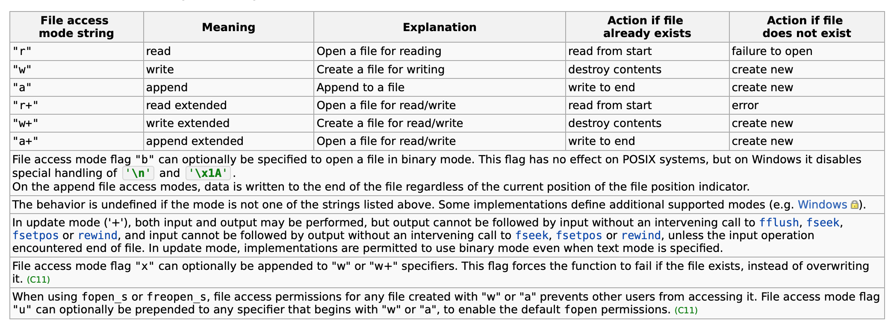

# 生产软件相关

[TOC]

> 更新日志
>
> * 2018-03-18 修改云端接口部分，将查询api接口扩充
> * 2018-03-18 新增字段，rotationCoef：回转系数(int)
> * 2018-03-19 update通过id进行修改


## 一、整体流程

> 流程图如下




* 基表生产完成后，将基表信息录入到数据库
* 成表安装时
  * 扫描基表号码，自动从数据库中搜索基表信息显示
  * 扫描电路板号码
  * 填写表底数
  * 点击发送按钮，等待接收
  * 接收成功后，将数据发送至云端，更新对应基表信息


## 二、云端部分

> 主要功能如下

* 采用restful形式处理，本地软件不直接读写数据库
* 主要功能为导入基表数据、查询表具信息，更新表具信息

### 2.1 数据库所需字段设置

```
id：主键

------------ 导入时携带字段 ---------------
importTime：导入时间(str, yyyy-MM-dd hh:mm:ss)
meterId：基表号码 (str)
rotationCoef：回转系数(int)
gearId：齿轮号码(str)
gear1Number：齿轮1号码(int)
gear2Number：齿轮2号码(int)
ratedFlow：型号(int)
host: 主机地址(str)
port：端口号(str)
batch：批次(str)
manufacturer：厂商名称(str)
importRemark：导入备注(str)
------------ 设置时时携带字段 ---------------
updateTime：设置时间(str, yyyy-MM-dd hh:mm:ss)
boardId: 电路板号码(int)
meterBase：表底数(int)
updateRemark：设置备注(str)
```


### 2.2 接口部分

#### 导入接口

```json
method: post
path: /import
content-type: application/json
data: {
    "batch": $BATCH,
    "meterList" : [
        {"meterId": $METER_ID ...},
        {"meterId": $METER_ID ...}	// 包含导入携带字段
    ]
}

// 回复体，exportTotal为导入数量
{ 
    "errorCode": 0, 
    "errorInfo": "", 
    "importTotal": $IMPORT_NUMBER
}
```

#### 查询接口

```json
method: post
path: /selectMeter
content-type: application/json
data: {
    // 提交需要查询的字段，可多个
    "meterId": $METER_ID,
    "batch": $BATCH
}

// 回复体
{ 
    "errorCode": 0, 
    "errorInfo": "", 
    "meterList": [
        {"meterId": $METER_ID ...},		// 包含所有字段
        {"meterId": $METER_ID ...},		// 包含所有字段
   ]
}
```

#### 更新接口

```json
method: post
path: /updateMeter
content-type: application/json
data: {
    "id": $ID,
    "boardInfo": {
        "boardId": $BOARD_ID,
        "meterBase"：$METER_BASE,
        "setRemark"：$SET_REMARK
    }
}

// 回复体
{ 
    "errorCode": 0, 
    "errorInfo": "",
    "meterInfo": {"meterId": $METER_ID ...}		// 包含所有字段
}
```


## 三、本地部分